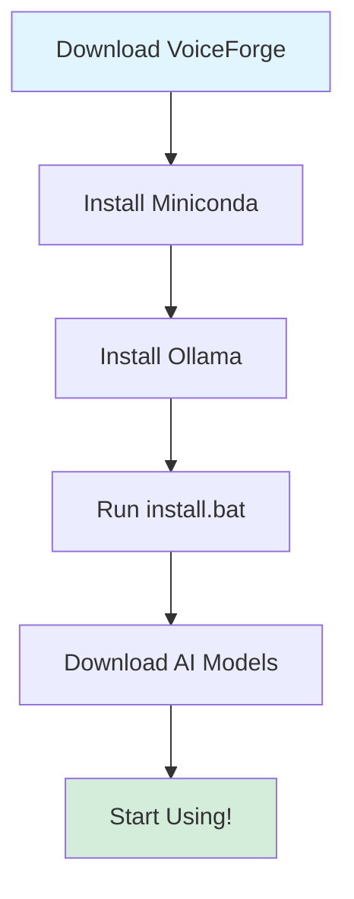
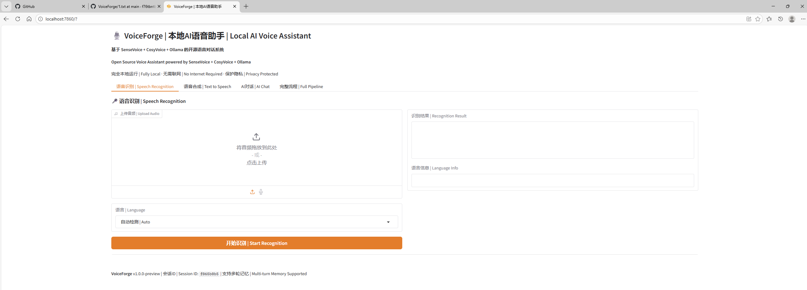
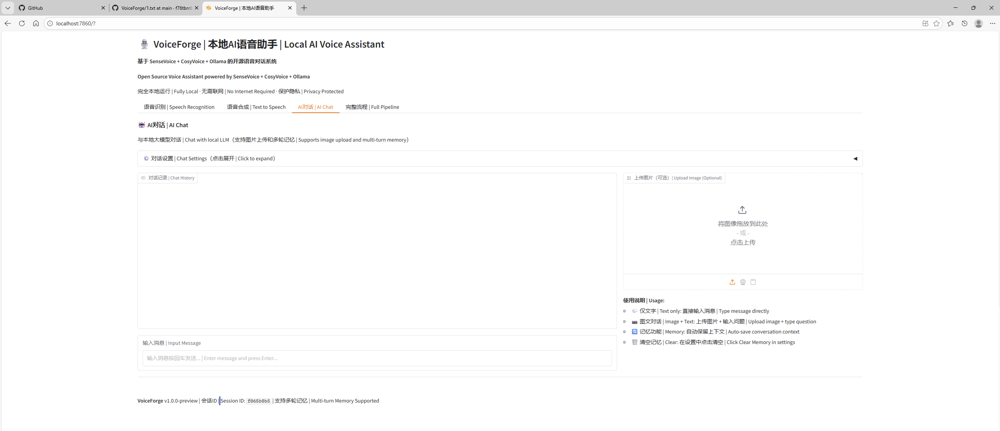
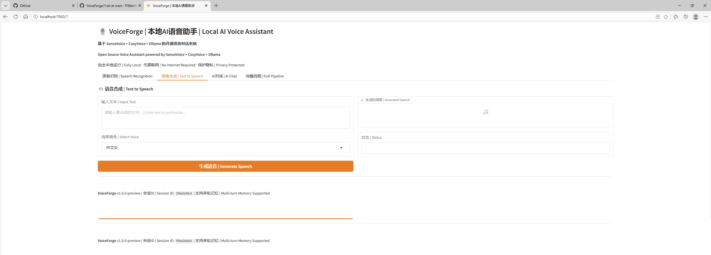
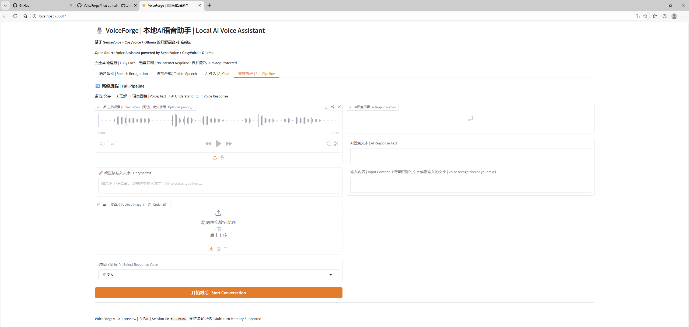

# 🎙️ VoiceForge

[](https://www.python.org/downloads/)
[](https://opensource.org/licenses/Apache-2.0)
[](https://www.microsoft.com/windows)

> 🚀 **100% Coded by Kimi-K2.5** | One-click installer for Local AI Voice Assistant  
> 😊 Project name also suggested by Kimi

**English** | [中文](README_CN.md)

---

## 🌟 Project Vision

**VoiceForge** aims to solve the installation complexity of ASR + LLM + TTS stack. This project allows users to quickly install a complete local AI voice assistant with one click.

Currently configured with **Gemma3:4b** as the default LLM, but you can easily switch to any other model supported by Ollama. Experience the power of AI voice assistant running entirely on your local machine!

**Key Features:**
- 🏠 **Fully Offline** - No internet required, complete privacy protection
- 🚀 **One-Click Install** - Automated setup with `install.bat`
- 🎯 **Windows-First** - Optimized for Windows 10/11
- 🧠 **Model Flexibility** - Easy to swap LLM models

---

## ✨ Features

| Component | Technology | Description | Status |
|-----------|------------|-------------|--------|
| 🎤 **ASR** | Alibaba SenseVoice | Multilingual speech recognition (Chinese, English, Japanese, etc.) | ✅ |
| 🧠 **LLM** | Ollama + Gemma3:4b | Local AI conversation, configurable model | ✅ |
| 🔊 **TTS** | Alibaba CosyVoice | High-quality voice synthesis with 8 voices | ✅ |
| 🖼️ **Vision** | Multimodal Support | Image understanding and description | ✅ |
| 💬 **Memory** | Multi-turn Context | Automatic conversation history management | ✅ |
| ⚙️ **Config** | Hot-reload | Real-time configuration changes without restart | ✅ |

---

## 💻 System Requirements

| Component | Minimum | Recommended |
|-----------|---------|-------------|
| **OS** | Windows 10 | **Windows 11** |
| **CPU** | Intel i5 / AMD Ryzen 5 | Intel i7 / AMD Ryzen 7 |
| **RAM** | 8 GB | 16 GB |
| **GPU** | NVIDIA GTX 1060 (6GB) | **NVIDIA RTX 3060 (12GB)** |
| **CUDA** | 11.8 | 12.1 |
| **Storage** | 10 GB free | 20 GB free |
| **Python** | 3.10 | 3.10 |

---

## ⚠️ Prerequisites (Required)

Before using VoiceForge, you must install the following software:

### 1. Miniconda (Required)
- **Download**: https://docs.conda.io/en/latest/miniconda.html
- **Size**: ~50MB
- **Installation**: Run installer and check "Add to PATH"
- **Why**: Manages Python environment and dependencies

### 2. Ollama (Required)
- **Download**: https://ollama.com/download
- **Size**: ~200MB (plus model files)
- **Installation**: Run installer
- **Why**: Runs the local LLM (Gemma3:4b by default)

**Note**: Git is **NOT required** - CosyVoice library is already included in `libs/` folder!

---

## 📋 Installation Flow



---

## 🚀 Quick Start

### Method 1: One-Click Installation (Recommended)

```powershell
# 1. Download and extract to C:\VoiceForge (or any directory)

# 2. Navigate to project directory
cd C:\VoiceForge

# 3. Run installer
.\scripts\install.bat
```

The installer will automatically:
1. ✅ Check system requirements
2. ✅ Create Conda environment (`voiceforge`)
3. ✅ Install PyTorch (with CUDA support)
4. ✅ Install all dependencies
5. ✅ Download AI models (optional)

### Method 2: Manual Installation

```powershell
# 1. Create Conda environment
conda create -n voiceforge python=3.10 -y

# 2. Activate environment
conda activate voiceforge

# 3. Install PyTorch (choose based on your CUDA version)
# For CUDA 12.1:
pip install torch==2.5.1 torchaudio==2.5.1 --index-url https://download.pytorch.org/whl/cu121

# 4. Install dependencies
pip install -r requirements.txt
```

---

## 📥 Model Download

### Automatic Download (China Mainland network recommended)

```powershell
python scripts\download_models.py
```

### Manual Download

1. **SenseVoice Model** (~800MB):
   - Visit: https://modelscope.cn/models/iic/SenseVoiceSmall
   - Download to: `models/asr/SenseVoiceSmall/`

2. **CosyVoice Model** (~3GB):
   - Visit: https://modelscope.cn/models/iic/CosyVoice-300M-SFT
   - Download to: `models/tts/CosyVoice-300M-SFT/`

---

## ▶️ Usage

### Start Web Interface

```powershell
.\scripts\start_web.bat
```

Access: http://localhost:7860

### Features

- 🎤 **Speech Recognition**: Upload audio file for transcription
- 🔊 **Text-to-Speech**: Generate speech with 8 different voices
- 💬 **AI Chat**: Multi-turn conversation with memory
- 🖼️ **Image Understanding**: Upload images and ask questions
- 🔄 **Complete Pipeline**: Voice → AI → Voice response

---

## 📸 Screenshots

### Main Interface


###  AI Chat


### Voice Synthesis


### Full Pipeline


---

## 🔧 Configuration

Edit `config.yaml` to customize:

```yaml
models:
  llm:
    ollama:
      model: "gemma3:4b"        # Change to your preferred model
      max_tokens: 80            # Response length limit
      system_prompt: "..."       # AI behavior instructions
```

**Hot-reload supported** - Changes take effect immediately without restart!

---

## 🏗️ Architecture

```
VoiceForge/
├── api/              # REST API server (Flask)
├── web/              # Web interface (Gradio)
├── plugins/          # ASR/TTS plugins
├── scripts/          # Installation & startup scripts
├── libs/             # Third-party libraries (CosyVoice)
├── models/           # AI models (not included, download separately)
└── doc/              # Documentation
```

---

## 🛠️ Troubleshooting

### PyTorch Installation Failed

```powershell
# Clean cache
conda clean --all -y

# Use Conda (stable for China)
conda install pytorch==2.5.1 torchaudio==2.5.1 pytorch-cuda=12.1 -c pytorch -c nvidia -y
```

### Missing hyperpyyaml Module

```powershell
conda activate voiceforge
pip install hyperpyyaml omegaconf torchmetrics
```

### CUDA Not Available

```powershell
python -c "import torch; print(torch.cuda.is_available())"
```

If returns `False`, check:
- NVIDIA drivers installed and up-to-date
- PyTorch CUDA version matches your system
- GPU is properly connected

---

## 🤝 Contributing

We welcome contributions! Please feel free to submit issues or pull requests.

1. Fork the repository
2. Create your feature branch (`git checkout -b feature/AmazingFeature`)
3. Commit your changes (`git commit -m 'Add some AmazingFeature'`)
4. Push to the branch (`git push origin feature/AmazingFeature`)
5. Open a Pull Request

---

## 📝 License

This project is licensed under the Apache License 2.0 - see the [LICENSE](LICENSE) file for details.

Copyright 2026 purey.zhan

---

## 🙏 Acknowledgments

- **Kimi-K2.5** - This project is 100% coded by Kimi AI assistant
- **Alibaba** - SenseVoice & CosyVoice models
- **Google** - Gemma model
- **Ollama** - Local LLM runtime
- **Gradio** - Web interface framework

---

## 📮 Contact & Support

- GitHub Issues: [Report bugs or request features](https://github.com/f76tbntbww-crypto/VoiceForge/issues)

---

**⭐ Star this repo if you find it helpful!**
