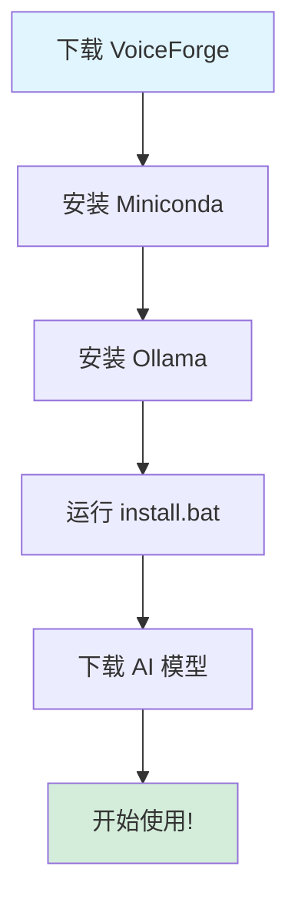

# 🎙️ VoiceForge - AI语音锻造所

[](https://www.python.org/downloads/)
[](https://opensource.org/licenses/Apache-2.0)
[](https://www.microsoft.com/windows)

> 🚀 **本项目完全由 Kimi-K2.5 编码完成**  
> 😊 项目名称也是 Kimi 起的  
> **目的**：解决 ASR+LLM+TTS 安装过程中的难点，让用户一键安装本地 AI 语音助手

[English](README.md) | **中文**

---

## 🌟 项目愿景

**VoiceForge** 旨在解决 ASR + LLM + TTS 技术栈的安装复杂性。通过本项目，用户可以快速一键安装完整的本地 AI 语音助手。

目前默认配置的 AI 大模型是 **Gemma3:4b**，但您可以轻松更换为 Ollama 支持的任何其他模型。体验在本地机器上运行的 AI 语音助手的强大功能！

**核心特点：**
- 🏠 **完全离线** - 无需联网，完整隐私保护
- 🚀 **一键安装** - 使用 `install.bat` 自动化安装
- 🎯 **Windows优先** - 专为 Windows 10/11 优化
- 🧠 **模型灵活** - 轻松更换 LLM 模型

---

## ✨ 功能特性

| 组件 | 技术 | 描述 | 状态 |
|-----------|------------|-------------|--------|
| 🎤 **语音识别** | 阿里 SenseVoice | 多语言语音识别（中、英、日等） | ✅ |
| 🧠 **AI对话** | Ollama + Gemma3:4b | 本地 AI 对话，可配置模型 | ✅ |
| 🔊 **语音合成** | 阿里 CosyVoice | 8种音色高质量语音合成 | ✅ |
| 🖼️ **图片理解** | 多模态支持 | 图片理解和描述 | ✅ |
| 💬 **多轮记忆** | 上下文管理 | 自动对话历史管理 | ✅ |
| ⚙️ **热更新** | 实时配置 | 无需重启实时修改配置 | ✅ |

---

## 💻 系统要求（重点：Windows）

| 组件 | 最低要求 | 推荐配置 |
|-----------|---------|-------------|
| **操作系统** | Windows 10 | **Windows 11** |
| **CPU** | Intel i5 / AMD Ryzen 5 | Intel i7 / AMD Ryzen 7 |
| **内存** | 8 GB | 16 GB |
| **显卡** | NVIDIA GTX 1060 (6GB) | **NVIDIA RTX 3060 (12GB)** |
| **CUDA** | 11.8 | 12.1 |
| **硬盘** | 10 GB 可用空间 | 20 GB 可用空间 |
| **Python** | 3.10 | 3.10 |

---

## ⚠️ 前置要求（必须）

使用 VoiceForge 前，必须先安装以下软件：

### 1. Miniconda（必须）
- **下载**：https://docs.conda.io/en/latest/miniconda.html
- **大小**：约 50MB
- **安装**：运行安装程序，勾选"Add to PATH"
- **作用**：管理 Python 环境和依赖包

### 2. Ollama（必须）
- **下载**：https://ollama.com/download
- **大小**：约 200MB（不含模型文件）
- **安装**：运行安装程序
- **作用**：运行本地大模型（默认 Gemma3:4b）

**注意**：**无需安装 Git** - CosyVoice 库已包含在 `libs/` 文件夹中！

---

## 📋 安装流程图



---

## 🚀 快速开始

### 方式一：一键安装（推荐）

```powershell
# 1. 下载并解压到 C:\VoiceForge（或任意目录）

# 2. 进入项目目录
cd C:\VoiceForge

# 3. 运行安装脚本
.\scripts\install.bat
```

安装脚本将自动完成：
1. ✅ 检查系统环境
2. ✅ 创建 Conda 环境（voiceforge）
3. ✅ 安装 PyTorch（支持 CUDA）
4. ✅ 安装所有依赖
5. ✅ 下载 AI 模型（可选）

### 方式二：手动安装

```powershell
# 1. 创建 Conda 环境
conda create -n voiceforge python=3.10 -y

# 2. 激活环境
conda activate voiceforge

# 3. 安装 PyTorch（根据 CUDA 版本选择）
# CUDA 12.1:
pip install torch==2.5.1 torchaudio==2.5.1 --index-url https://download.pytorch.org/whl/cu121

# 4. 安装依赖
pip install -r requirements.txt
```

---

## 📥 模型下载

### 自动下载（推荐中国大陆网络）

```powershell
python scripts\download_models.py
```

### 手动下载

1. **SenseVoice 模型**（约 800MB）：
   - 访问：https://modelscope.cn/models/iic/SenseVoiceSmall
   - 下载到：`models/asr/SenseVoiceSmall/`

2. **CosyVoice 模型**（约 3GB）：
   - 访问：https://modelscope.cn/models/iic/CosyVoice-300M-SFT
   - 下载到：`models/tts/CosyVoice-300M-SFT/`

---

## ▶️ 使用方法

### 启动 Web 界面

```powershell
.\scripts\start_web.bat
```

访问：http://localhost:7860

### 功能说明

- 🎤 **语音识别**：上传音频文件进行转录
- 🔊 **语音合成**：使用 8 种不同音色生成语音
- 💬 **AI 对话**：带记忆功能的多轮对话
- 🖼️ **图片理解**：上传图片并提问
- 🔄 **完整流程**：语音 → AI → 语音回复

---

## 📸 界面预览

*[截图将在此处添加]*

<!-- 


-->

---

## 🔧 配置说明

编辑 `config.yaml` 进行自定义：

```yaml
models:
  llm:
    ollama:
      model: "gemma3:4b"        # 更换为您喜欢的模型
      max_tokens: 80            # 回复长度限制
      system_prompt: "..."       # AI 行为指令
```

**支持热更新** - 修改后立即生效，无需重启！

---

## 🏗️ 项目架构

```
VoiceForge/
├── api/              # REST API 服务 (Flask)
├── web/              # Web 界面 (Gradio)
├── plugins/          # ASR/TTS 插件
├── scripts/          # 安装和启动脚本
├── libs/             # 第三方库 (CosyVoice)
├── models/           # AI 模型（需单独下载）
└── doc/              # 文档
```

---

## 🛠️ 故障排除

### PyTorch 安装失败

```powershell
# 清理缓存
conda clean --all -y

# 使用 Conda 安装（国内稳定）
conda install pytorch==2.5.1 torchaudio==2.5.1 pytorch-cuda=12.1 -c pytorch -c nvidia -y
```

### 缺少 hyperpyyaml 模块

```powershell
conda activate voiceforge
pip install hyperpyyaml omegaconf torchmetrics
```

### CUDA 不可用

```powershell
python -c "import torch; print(torch.cuda.is_available())"
```

如果返回 `False`，请检查：
- NVIDIA 驱动是否安装且为最新版本
- PyTorch CUDA 版本是否与系统匹配
- 显卡是否正确连接

---

## 🤝 贡献指南

欢迎提交 Issue 或 Pull Request！

1. Fork 本仓库
2. 创建功能分支 (`git checkout -b feature/AmazingFeature`)
3. 提交更改 (`git commit -m '添加某个功能'`)
4. 推送到分支 (`git push origin feature/AmazingFeature`)
5. 创建 Pull Request

---

## 📝 开源协议

本项目采用 Apache License 2.0 协议 - 详见 [LICENSE](LICENSE) 文件。

版权所有 2026 purey.zhan

---

## 🙏 致谢

- **Kimi-K2.5** - 本项目完全由 Kimi AI 助手编码完成
- **阿里巴巴** - SenseVoice 和 CosyVoice 模型
- **Google** - Gemma 模型
- **Ollama** - 本地 LLM 运行时
- **Gradio** - Web 界面框架

---

## 📮 联系方式

- GitHub Issues: [报告问题或请求功能](https://github.com/f76tbntbww-crypto/VoiceForge/issues)

---

**⭐ 如果本项目对您有帮助，请给个 Star！**
